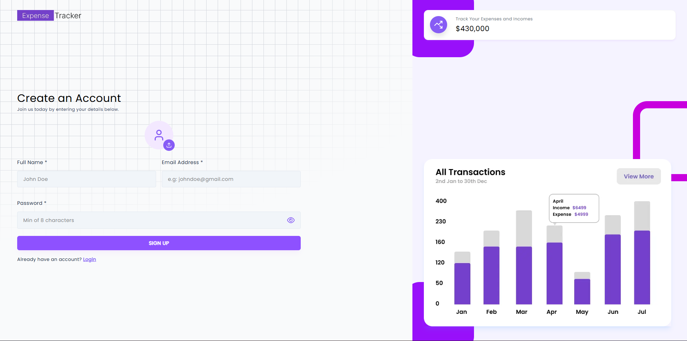
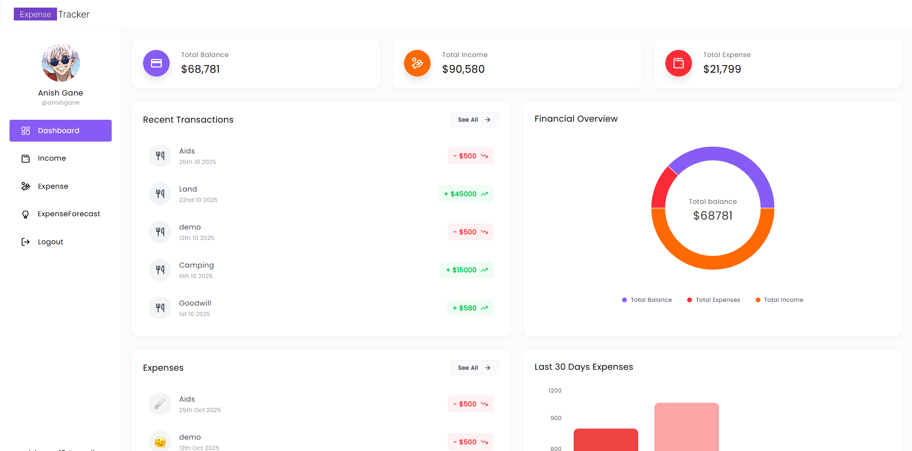
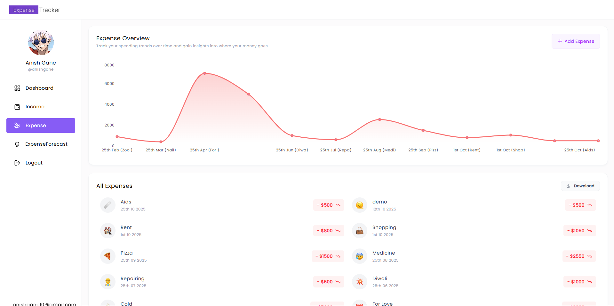
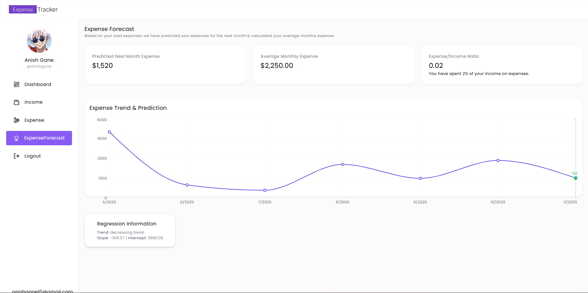
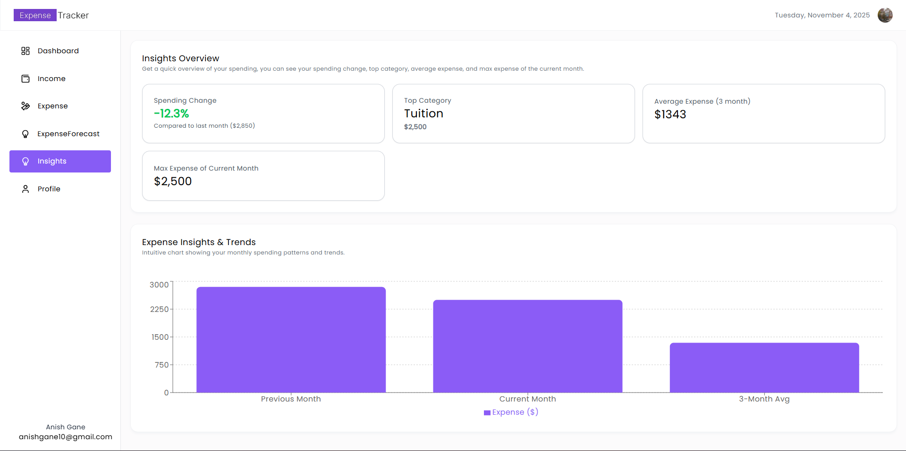
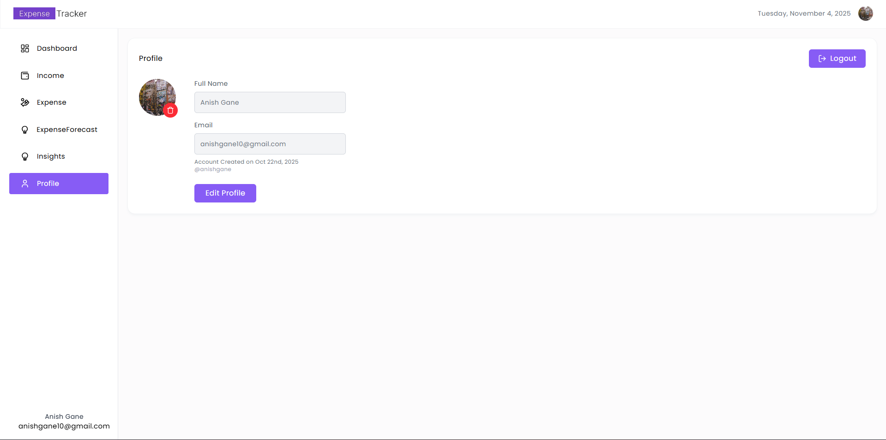

<div align="center">
    
</div>

# 💰 Expense Tracker

**Expense Tracker** is a modern React-powered web application designed to help you manage your personal finances effortlessly.
It allows you to **record**, **analyze**, and **visualize** your expenses and income through clean, interactive charts and an intuitive user interface.

With this app, you can:

- 📊 **Track your monthly expenses** across different categories (like food, rent, travel, etc.).
- 💵 **Monitor your income sources** and understand where your earnings are coming from.
- 📈 **Visualize spending patterns** through dynamic charts and graphs for better financial awareness.
- 🧠 **Gain insights and predictions** using simple data analytics to estimate next month’s expenses.
- ⚙️ **Easily manage transactions** — add, edit, or delete income and expense entries.
- 🔒 **Enjoy a secure experience** with user authentication and personalized data access.

Built with React.js, this application focuses on a **minimal**, **clean design** and **real-time responsiveness**, making financial tracking more insightful and less stressful.

---

## 🧰 Tech Stack

**Frontend :**

- ⚛️ [React.js](https://react.dev/) – UI library for building dynamic user interfaces
- 🎨 [Tailwind CSS](https://tailwindcss.com/) – For fast and responsive styling
- 📈 [Recharts](https://recharts.org/) – Used to create interactive charts and visual analytics
- 🔥 [Axios](https://axios-http.com/) – For API communication
- 🍞 [React Hot Toast](https://react-hot-toast.com/) – For beautiful toast notifications
- ✒️ [fontsource/poppins](https://www.npmjs.com/package/@fontsource/poppins) - For poppins font
- 🤨 [emoji-picker-react](https://www.npmjs.com/package/emoji-picker-react) - For adding icon or emoji in your applicaion
- 🕐 [moment](https://momentjs.com/docs/) - For date formats

**Backend :**

- 🟢 [Node.js](https://nodejs.org/) – JavaScript runtime for backend logic
- 🚀 [Express.js](https://expressjs.com/) – Framework for building REST APIs
- 🍃 [MongoDB](https://www.mongodb.com/) – NoSQL database for storing user data and transactions
- 🔐 [JWT Authentication](https://jwt.io/) – For secure user sessions
- ☁️ [Cloudinary](https://cloudinary.com/) - cloud-based media management service, to handle everything related to images and videos — uploading, storing, optimizing, transforming, and delivering them efficiently via a Content Delivery Network (CDN).
- 🧩 [Multer](https://blog.logrocket.com/multer-nodejs-express-upload-file/) - handles file uploads locally or temporarily before uploading to Cloudinary
- 📝 [PDFKit](https://pdfkit.org/docs/getting_started.html) - To create and generate PDF documents programmatically.
- 📋 [xlsx](https://www.npmjs.com/package/xlsx) - To read, write, and manipulate Excel (.xlsx, .xls, .csv) files

---

## ⚙️ Features

- ✅ User Authentication (Register/Login)
- ✅ Add, Edit, and Delete Transactions
- ✅ Categorized Expense Tracking
- ✅ Monthly and Category-wise Analysis
- ✅ Expense Forecast using Simple Linear Regression
- ✅ Dashboard Overview with Visual Charts
- ✅ Real-Time Data Updates
- ✅ Download income and expense report in excel format as well as in pdf for future use
- ✅ Insight Overview of Expense
- ✅ User Profile

---

## 🪜 Installation & Setup

Follow these steps to run the project locally:

```
# 1️⃣ Clone the repository
git clone https://github.com/yourusername/expense-tracker.git

# 2️⃣ Navigate into the project folder
cd expense-tracker

# 3️⃣ Install dependencies for backend
cd backend
npm install

# 4️⃣ Run the backend server
npm run server

# 5️⃣ Install dependencies for frontend
cd frontend
npm install

# 6️⃣ Run the frontend
npm run dev

```

## ⚙️ Environment Setup

**Frontend**

```
VITE_BASE_URL = your_deployed_backendURL || http://localhost:8000
```

**Backend**

```
PORT = port_number
MONGO_URI = your_mongodb_string
JWT_SECRET = your_jwt_secret
CLIENT_URL = your_deployed_frontedURL || http://localhost:5173

# Cloudinary api keys (get from cloudinary)
CLOUDINARY_CLOUD_NAME= your_cloud_name
CLOUDINARY_API_KEY=your_cloud_apikey
CLOUDINARY_API_SECRET=your_cloud_apisecret
```

---

The app will be available locally at:
👉 Frontend: http://localhost:5173
👉 Backend: http://localhost:8000

_Tips: Use this command (node -e "console.log(require('crypto').randomBytes(64).toString('hex'))"), to generate your own JWT Secret key_

---

## 📂 Folder Structure

```

expense-tracker/
├── backend/
| ├── config/
│ ├── controllers/
│ ├── middlewares/
│ ├── models/
│ ├── routes/
│ └── server.js
├── frontend/
│ ├── src/
│ │ ├── components/
│ │ ├── pages/
│ │ ├── context/
│ │ ├── hooks/
│ │ ├── utils/
│ │ ├── App.jsx
│ └── public/
└── README.md

```

## Screenshots

### 🔐 Sign Up Page


_Sign up page for user to create a account_

### 🖥️ Dashboard Page


_Dashboard Overview page for recent transactions, last 30 days expenses & many more_

### 💸 Expense Page


_Expense Overview with intuitive UI & interactive chart and expenses history with real-time transacrions_

### 💸 Expense Forecast Page


_Expense Forecast to show the prediction for next month expense, average monthly expense and expense/income ratio with interactive chart_

### 💹 Insights


_Quick Expense Insight Overview about spending charge, top category & many more_

### 👨‍🦱 user Profile Page


_Profile page to show the user image and user details_

---

## 🤝 Contributing

Contributions are always welcome!
If you’d like to improve the project, feel free to fork the repo, create a branch, and submit a pull request.

## 📜 License

This project is licensed under the **MIT License** - see the [LICENSE](./LICENSE) file for details.

## ✨ Acknowledgements

Special thanks to:

- React, Express & MongoDB documentation
- Recharts and Tailwind CSS for great developer experience

---

**Author :** [AnishGane](https://github.com/AnishGane)
**For More Details :** anishgane10@gmail.com

```

```
